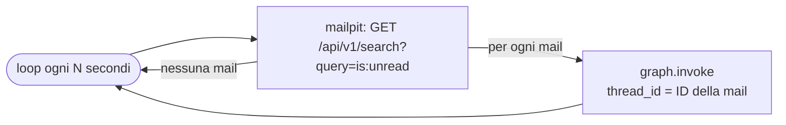
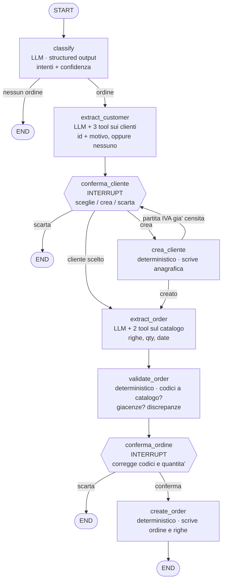

# erp-agent-graph — flusso intake ordini

> **Questo documento descrive il flusso bersaglio, non quello implementato.**
>
> Su `main` oggi girano i primi due nodi: `classify` e `extract_customer`. Tutto il
> resto del disegno qui sotto — conferma del cliente, estrazione delle righe d'ordine,
> validazione, conferma dell'ordine, scrittura a database — è progettato e motivato,
> ma **non è ancora codice**. Gli interrupt di human-in-the-loop non esistono nel
> grafo compilato.
>
> Per sapere cosa fa il progetto adesso, vedi il [README](README.md).

Prototipo: **solo il ramo ordine**. Il ticket è previsto dal disegno ma non implementato (vedi *Estensioni previste*).

**Un thread per mail**: `thread_id` = ID Mailpit del messaggio. Il polling sta **fuori** dal grafo.

## Dispatcher (fuori dal grafo)

Codice deterministico, niente LLM, niente stato. Gira in loop dentro un container.



## Grafo ordine (un run per mail)



**Sequenziale, non parallelo.** `extract_order` gira **dopo** che il cliente e' confermato:
cosi' mette nel prompt lo storico d'acquisto di quel cliente, e le mail vaghe ("le solite
guarnizioni", "la misura piccola") si sciolgono da sole invece di finire sul tavolo di chi
revisiona. E' l'unica dipendenza vera fra i due rami, ed e' il motivo per cui non corrono
in parallelo.

**Un solo interrupt pendente per volta**, quindi il resume e' `Command(resume=valore)`
senza la mappa `{interrupt_id: valore}`.

### Il ciclo su crea_cliente

`crea_cliente` rientra in `conferma_cliente` solo quando la scrittura non e' andata:
partita IVA gia' di un altro cliente, tipicamente. Chi revisiona rivede il modulo con
scritto perche' non e' passato e i dati che aveva gia' digitato.

Il nodo **non solleva eccezioni**: cattura e mette l'errore nello stato. Il valore di un
resume resta legato al task che l'ha consumato -- se il nodo esplode, rilanciarlo rilegge
la stessa partita IVA duplicata e il thread e' piantato per sempre.

### Chiavi di stato, e chi le scrive

| chiave | scritta da |
|---|---|
| `email`, `verdict` | `classify` |
| `customer_choice` | `extract_customer` |
| `confirmed_customer_id` | `conferma_cliente`, `crea_cliente` |
| `anagrafica_da_creare`, `errore_anagrafica` | `conferma_cliente`, `crea_cliente` |
| `extracted_order` | `extract_order`, `conferma_ordine` |
| `discrepancies` | `validate_order` |
| `created_order_id` | `create_order` |

### Cosa risponde chi revisiona

```
# conferma_cliente
{"azione": "scelto" | "crea" | "scarta",
 "customer_id": int | None,      # con "scelto"
 "anagrafica": {...} | None}     # con "crea"

# conferma_ordine
{"conferma": bool,
 "customer_reference": str | None,
 "lines": [{"article_code", "quantity", "requested_date"}, ...]}
```

Una voce di `lines` per riga, nello stesso ordine. **Codice vuoto = riga scartata**: e'
l'unico modo di scartarne una, perche' senza codice non puo' diventare una riga d'ordine.

## Note

- Il grafo **non sa che esiste una casella di posta**: il suo input è *una* mail. Si testa passandogli una mail finta, senza rete.
- `validate_order` produce le discrepanze come dato nello stato — chi revisiona le legge, non le ricalcola.
- `classify_mail` restituisce una **lista di intenti**, non un booleano, anche se il prototipo instrada solo `ordine`: così il ticket si aggiunge senza toccare il nodo.
- Un solo interrupt pendente per thread → il resume è `Command(resume=valore)`, senza mappa di id. È una conseguenza del grafo sequenziale: con due rami paralleli servirebbe `{interrupt_id: valore}`.
- La lista "ordini da approvare" **non è un nodo**, e non è nemmeno una tabella: sono i thread del checkpointer fermi su un interrupt. A database un ordine ci finisce solo quando è stato approvato — niente stato `da_approvare`, niente righe provvisorie.

## Estensioni previste (fuori dal prototipo)

- **Ramo ticket**: una mail può produrre ordine e ticket insieme. Secondo `Send` da `classify_mail`, chiavi di stato separate (`ordini_pending`, `ticket_pending`), secondo interrupt con ruolo *assistenza*. Attenzione: due interrupt pendenti nello stesso thread richiedono la mappa `{interrupt_id: valore}`.
- **Digest via mail**: job separato che interroga `orders` e manda un riepilogo. Fuori dal grafo.
- **Webhook Mailpit** al posto del polling.
- **Chat sullo stato sospeso**: secondo grafo che legge lo stesso DB.

## Decisioni prese

- Prototipo limitato al **ramo ordine**.
- **`thread_id` = ID Mailpit della mail.** Un thread per mail, sospensioni indipendenti.
- **`poll_mailbox` fuori dal grafo**, in un dispatcher: un nodo gira già dentro un thread e non può crearne altri.
- **`collect_pending` rimosso** e **`send_digest` fuori dal grafo**: con un thread per mail non esiste un punto in cui i rami convergono.
- **Approvazioni sequenziali**, niente approvazione parallela multi-ruolo sullo stesso oggetto.
- **Claim/lock sul task rimandato**: la race esiste solo con due resume simultanei sullo stesso thread.
- **Dispatcher come loop in un container** (`restart: unless-stopped`), non cron.

## Da decidere

- **Idempotenza**: `GET /api/v1/message/{ID}` marca la mail come letta da solo. Se il processo muore dopo la lettura e prima di `create_order`, quella mail esce dalla coda delle non lette. Serve una tabella di stato, o basta che `thread_id = ID` renda il riprocesso innocuo?
- **`propose_next_action` è stato tolto**: non aveva consumatori.
- ~~Modello LLM e client~~: DeepSeek, `deepseek-v4-pro`, via `langchain-deepseek`. Non supporta `response_format` json: l'output strutturato passa da `ToolStrategy` o da `with_structured_output(method="function_calling")`.

## Verificato sui sorgenti LangGraph

- Con **più interrupt pendenti nello stesso thread**, `Command(resume="valore")` fallisce: *"When there are multiple pending interrupts, you must specify the interrupt id when resuming."*
- Forma corretta: `Command(resume={interrupt_id: valore})`. Si può rispondere a un interrupt per volta; l'altro resta pendente.
- Con **un solo interrupt pendente** basta `Command(resume=valore)`.
- Rami paralleli che scrivono **chiavi diverse** non confliggono: è il caso normale del fan-out. Il rischio è solo il resume simultaneo sullo stesso thread.
- `langgraph.json` serve solo per il deploy su LangGraph Platform: qui non serve.

## Verificato sull'API Mailpit

| Cosa | Chiamata |
|---|---|
| Non lette | `GET /api/v1/search?query=is:unread` → `messages`, `messages_count` |
| Tutte | `GET /api/v1/messages?limit=N` → include il flag `Read` |
| Corpo | `GET /api/v1/message/{ID}` → `Text`, `HTML`, `Attachments`, `Date` ⚠️ **marca la mail come letta** |
| Marca / smarca | `PUT /api/v1/messages` body `{"IDs": [...], "Read": true}` |
| Svuota | `DELETE /api/v1/messages` |

Campi della lista: `ID`, `From{Address,Name}`, `To[]`, `Subject`, `Created`, `Read`, `Snippet`, `Size`, `Attachments`.
