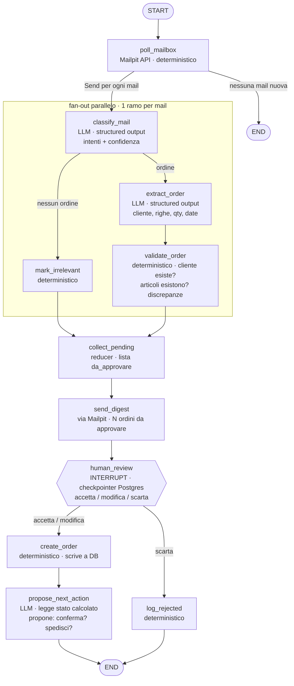

# erp-agent-graph — flusso intake ordini

Prototipo: **solo il ramo ordine**. Il ticket è previsto dal disegno ma non implementato (vedi *Estensioni previste*).

## Note

- `collect_pending` è l'unica chiave con reducer (`Annotated[list, operator.add]`); tutto il resto è overwrite.
- `validate_order` produce le discrepanze come dato nello stato — `propose_next_action` le legge, non le ricalcola.
- `classify_mail` restituisce una **lista di intenti**, non un booleano, anche se il prototipo instrada solo `ordine`: così il ticket si aggiunge senza toccare il nodo.
- La chat "mentre il grafo è sospeso" non è in questo diagramma: è un secondo grafo (o thread separato) che legge lo stesso DB. Da aggiungere dopo.

## Estensioni previste (fuori dal prototipo)

- **Ramo ticket**: una mail può produrre ordine e ticket insieme. Secondo `Send` da `classify_mail`, chiavi di stato separate (`ordini_pending`, `ticket_pending`), secondo interrupt con ruolo *assistenza*. Escluso ora per non gonfiare il prototipo.
- **Chat sullo stato sospeso**: secondo grafo che legge lo stesso DB.

## Decisioni prese

- Prototipo limitato al **ramo ordine**.
- **Approvazioni sequenziali**, niente approvazione parallela multi-ruolo sullo stesso oggetto.
- **Claim/lock sul task rimandato**: la race esiste solo con due resume simultanei sullo stesso thread.

## Da decidere

- **`thread_id` = message-id della mail** → `poll_mailbox` esce dal grafo e diventa un dispatcher che lancia un run per mail. Non ancora applicato al diagramma.
- **Idempotenza del polling**: marcatura su Mailpit vs tabella `processed_messages`.
- **`collect_pending` potrebbe essere superfluo**: il reducer aggrega già da solo.
- **`propose_next_action` non ha consumatori**: mail di risposta, riga a DB per la chat, o si toglie.

## Verificato sui sorgenti LangGraph

- Con **più interrupt pendenti nello stesso thread**, `Command(resume="valore")` fallisce: *"When there are multiple pending interrupts, you must specify the interrupt id when resuming."*
- Forma corretta: `Command(resume={interrupt_id: valore})`. Si può rispondere a un interrupt per volta; l'altro resta pendente.
- Con **un solo interrupt pendente** basta `Command(resume=valore)`.
- Rami paralleli che scrivono **chiavi diverse** non confliggono: è il caso normale del fan-out. Il rischio è solo il resume simultaneo sullo stesso thread.
