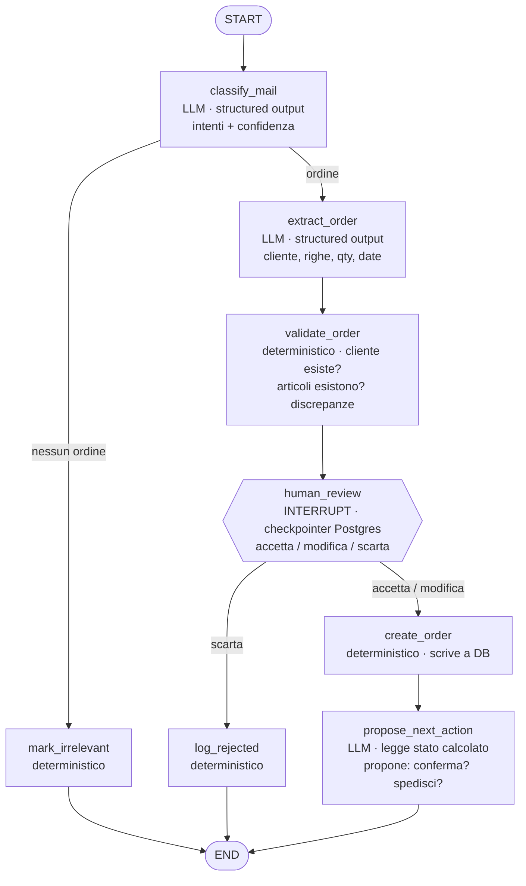

# erp-agent-graph — flusso intake ordini

Prototipo: **solo il ramo ordine**. Il ticket è previsto dal disegno ma non implementato (vedi *Estensioni previste*).

**Un thread per mail**: `thread_id` = ID Mailpit del messaggio. Il polling sta **fuori** dal grafo.

## Dispatcher (fuori dal grafo)

Codice deterministico, niente LLM, niente stato. Gira in loop dentro un container.

## Grafo ordine (un run per mail)

## Note

- Il grafo **non sa che esiste una casella di posta**: il suo input è *una* mail. Si testa passandogli una mail finta, senza rete.
- `validate_order` produce le discrepanze come dato nello stato — `propose_next_action` le legge, non le ricalcola.
- `classify_mail` restituisce una **lista di intenti**, non un booleano, anche se il prototipo instrada solo `ordine`: così il ticket si aggiunge senza toccare il nodo.
- Un solo interrupt pendente per thread → il resume è `Command(resume=valore)`, senza mappa di id.
- La lista "ordini da approvare" **non è un nodo**: è una query su `orders` in stato `da_approvare`, fatta dalla web app.

## Estensioni previste (fuori dal prototipo)

- **Ramo ticket**: una mail può produrre ordine e ticket insieme. Secondo `Send` da `classify_mail`, chiavi di stato separate (`ordini_pending`, `ticket_pending`), secondo interrupt con ruolo *assistenza*. Attenzione: due interrupt pendenti nello stesso thread richiedono la mappa `{interrupt_id: valore}`.
- **Digest via mail**: job separato che interroga `orders` e manda un riepilogo. Fuori dal grafo.
- **Webhook Mailpit** al posto del polling.
- **Chat sullo stato sospeso**: secondo grafo che legge lo stesso DB.

## Decisioni prese

- Prototipo limitato al **ramo ordine**.
- **`thread_id` = ID Mailpit della mail.** Un thread per mail, sospensioni indipendenti.
- **`poll_mailbox` fuori dal grafo**, in un dispatcher: un nodo gira già dentro un thread e non può crearne altri.
- **`collect_pending` rimosso** e **`send_digest` fuori dal grafo**: con un thread per mail non esiste un punto in cui i rami convergono.
- **Approvazioni sequenziali**, niente approvazione parallela multi-ruolo sullo stesso oggetto.
- **Claim/lock sul task rimandato**: la race esiste solo con due resume simultanei sullo stesso thread.
- **Dispatcher come loop in un container** (`restart: unless-stopped`), non cron.

## Da decidere

- **Idempotenza**: `GET /api/v1/message/{ID}` marca la mail come letta da solo. Se il processo muore dopo la lettura e prima di `create_order`, quella mail esce dalla coda delle non lette. Serve una tabella di stato, o basta che `thread_id = ID` renda il riprocesso innocuo?
- **`propose_next_action` non ha consumatori**: mail di risposta, riga a DB per la chat, o si toglie.
- Modello LLM e client (su `triage-mail` era DeepSeek).

## Verificato sui sorgenti LangGraph

- Con **più interrupt pendenti nello stesso thread**, `Command(resume="valore")` fallisce: *"When there are multiple pending interrupts, you must specify the interrupt id when resuming."*
- Forma corretta: `Command(resume={interrupt_id: valore})`. Si può rispondere a un interrupt per volta; l'altro resta pendente.
- Con **un solo interrupt pendente** basta `Command(resume=valore)`.
- Rami paralleli che scrivono **chiavi diverse** non confliggono: è il caso normale del fan-out. Il rischio è solo il resume simultaneo sullo stesso thread.
- `langgraph.json` serve solo per il deploy su LangGraph Platform: qui non serve.

## Verificato sull'API Mailpit

| Cosa | Chiamata |
|---|---|
| Non lette | `GET /api/v1/search?query=is:unread` → `messages`, `messages_count` |
| Tutte | `GET /api/v1/messages?limit=N` → include il flag `Read` |
| Corpo | `GET /api/v1/message/{ID}` → `Text`, `HTML`, `Attachments`, `Date` ⚠️ **marca la mail come letta** |
| Marca / smarca | `PUT /api/v1/messages` body `{"IDs": [...], "Read": true}` |
| Svuota | `DELETE /api/v1/messages` |

Campi della lista: `ID`, `From{Address,Name}`, `To[]`, `Subject`, `Created`, `Read`, `Snippet`, `Size`, `Attachments`.
